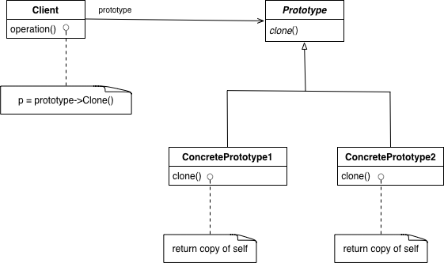

# 原型
**原型模式**：使用原型实例指定创建对象的种类，并且通过拷贝这些原型创建新的对象。

## 适用性
- 需要创建的对象应独立于其类型与创建方式
- 要实例化的类是在运行时决定的
- 不想要与产品层次相对应的工厂层次
- 不同类的实例间的差异仅是状态的若干组合。因此复制相应数量的原型比手工实例化更加方便
- 类不容易创建，比如每个组件可把其他组件作为子节点的组合对象。复制已有的组合对象并对副本进行修改会更加容易。
## 结构

- **Prototype**:声明一个克隆吱声的接口
- **ConcretePrototype**:实现一个克隆自身的操作
- **Client**:让一个原型克隆自身从而创建一个新的对象

## 效果

**优点**
- 运行时刻增加和删除产品
- 改变值以制定新对象
- 改变结构以指定新对象
- 减少子类的构造
- 用类动态配置应用

