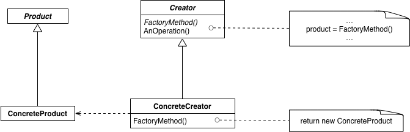

# 工厂方法
**工厂方法**：定义创建对象的接口，让子类决定实例化哪一个类。工厂方法使得一个类的实例化延迟到其子类。别名：***虚构造器(Virtual Constructor)***
**简单工厂**：***工厂方法***的一种变体，抽象类使用工厂方法创建其私有子类或任何其他类的对象(eg.  NSNumber)。不创建Creator及其子类而是通过工厂方法生成具体的Product
## 适用性
- 编译时无法准确预期要创建的对象的类

- 类想让其子类决定在运行时创建什么

- 类有若干辅助类为其子类，而你想将返回哪个子类这一信息局部化

## 结构

- **Product**:定义工厂方法所创建的对象的接口
- **ConcreteProduct**：实现Product接口
- **Creator**：声明工厂方法，该方法返回一个Product类型的对象。Creator也可以定义一个工厂方法的缺省实现，它返回一个缺省的ConcreteProduct对象；可以调用工厂方法以创建一个Product对象
- **ConcreteCreator**：重定义工厂方法以返回一个ConcreteProduct实例

## 效果

**缺点**：客户可能仅仅为了创建一个特定的ConcreteProduct对象，就不得不创建Creator的子类

**优点：**

1. 为子类提供hook

2. 连接平行的类层次

## 总结
- 简单工厂模式的最大优点在于工厂类中包含了必要的逻辑判断，根据客户端的选择条件动态实例化相关的类，对于客户端来说，去除了与具体产品的依赖
- 工厂方法把简单工厂的内部逻辑判断移到了客户端代码来进行。加功能时，本来是改工厂类的，现在是修改客户端

