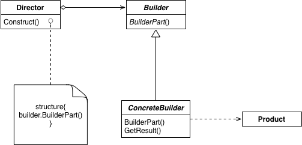

# 生成器
**生成器：**将一个复杂对象的构建与他的表示分离，使得同样的构建过程可以创建不同地表示。
## 适用性
- 当创建复杂对象的算法应该独立于该对象的组成部分以及它们的装配方式时。比如：构建组合对象
- 当构造过程必须允许被构造的对象有不同的表示时（例如，部件或表现的不同组合）
## 结构

- **builder:**为创建一个Product对象的各个部件指定抽象接口
- **ConcreteBuilder:**
	1.实现Builder的接口以构造和装配该产品的各个部件
	2. 定义并明确他所创建的表示
	3. 提供一个检索产品的接口
- **Director:**构建一个使用Builder接口的对象
- **Product:**
	1. 表示被构造的复杂对象。ConcreteBuider创建该产品的内部表示并定义它的装配过程
	2. 包含定义组成部件的类，包括将这些部件装配撑最终产品的接口
## 效果
1. 它使你可以改变一个产品的内部表示

2. 它将构造代码和表示代码分开

3. 它使你可对构造过程进行更精细的控制

## 总结
1. **builder概念的理解：将一个复杂对象的构建与他的表示分离，使得同样的构建过程可以创建不同地表示**
  复杂对象的构建通过Director指挥Builder创建。Product表示被构造的复杂对象。同样的过程只要客户端指定不同的ConcreteBuilder去供Director使用（或者由Director改变构建过程来生成不同的Product），就会产生不同的Product。

2. **product创建逻辑分布**
  product的创建由于通过Builder和Director共同创建，一般Builder负责具体部件构建，Director负责最后的装配

3. 生成器于抽象工厂对比

   |            生成器            |      抽象工厂      |
   | :--------------------------: | :----------------: |
   |         构建复杂对象         | 构建简单或复杂对象 |
   |      以多个步骤构建对象      | 以单一步骤构建对象 |
   |      以多种方式构建对象      | 以单一方式构建对象 |
   | 在构建过程的最后一步返回产品 |    立刻返回产品    |
   |       专注一个特定产品       |    强调一套产品    |

   

