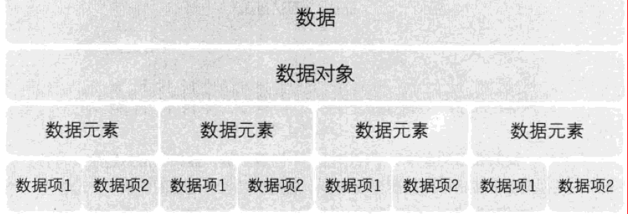
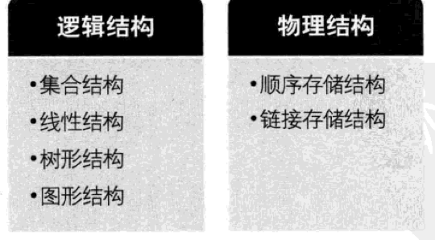

大话数据结构
===
[TOC]
## 数据结构绪论
数据结构：是相互之间存在一种或多种特定关系的数据元素集合
### 数据结构起源
数据结构是一门研究非数值计算的程序设计问题中的操作对象，以及它们之间的关系和操作等相关问题的学科

> 程序设计 = 数据结构 + 算法

### 基本概念和术语
**数据**：是描述客观事物的符号，是计算机中可以操作的对象，是能被计算机识别，并输入给计算机处理的符号集合。
**数据元素**：是组成数据的，有一定意义的基本单位，在计算机中通常被作为整体处理。也被成为记录
**数据项**：一个数据元素可以由若干个数据项组成。数据项是数据不可分割的最小单位。
**数据对象**：是性质相同的数据元素的集合，是数据的子集。
**数据结构**：是相互之间存在一种或多种特定关系的数据元素的集合。
### 逻辑结构与物理结构
#### 逻辑结构
**逻辑结构**：是指数据对象中数据元素之间的相互关系
1. 集合结构
2. 线性结构
3. 树形结构
4. 图形结构
#### 物理结构
**物理结构**：是指数据的逻辑结构在计算机中的存储形式。
1. 顺序存储结构
2. 连式存储结构
### 总结回顾

## 算法
## 线性表
## 栈与队列
## 串
## 树
## 图
## 查找
## 排序
